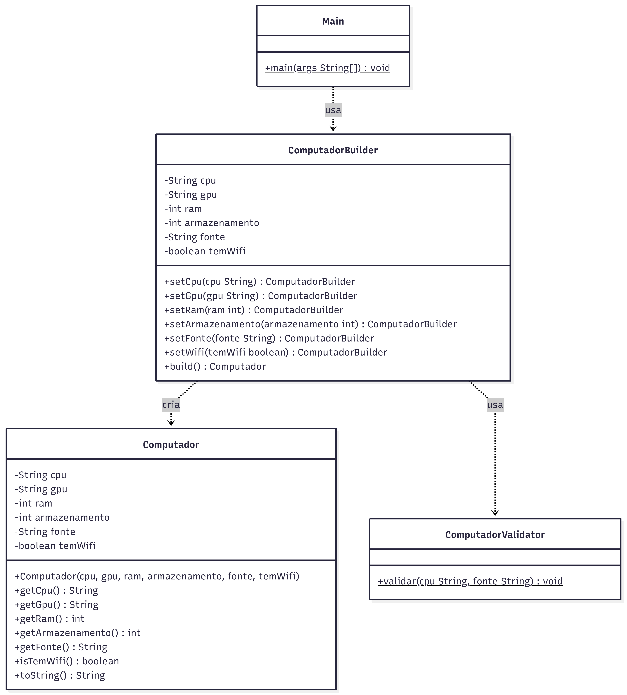

# 💻 Montagem de Computadores com Builder

Projeto simples desenvolvido em Java com o objetivo de demonstrar a aplicação do **padrão de projeto Builder** em conjunto com o **princípio da responsabilidade única (SRP)**.

---

## 📌 Sobre o projeto

O sistema simula a montagem de computadores personalizados, permitindo a criação de diferentes configurações de forma flexível e organizada.

A construção do objeto é feita passo a passo utilizando o padrão Builder, evitando construtores complexos e melhorando a legibilidade do código.

---

## 🧱 Estrutura do projeto

```
src/
├── main/
│   └── computador/
│       ├── Computador.java          // Representação dos dados
│       ├── ComputadorBuilder.java   // Construção do objeto
│       ├── ComputadorValidator.java // Validação das regras
│       └── Main.java                // Execução do sistema
│
└── test/
    └── computador/
        └── ComputadorBuilderTest.java // Testes unitários
```

---

## 🧠 Padrões e princípios utilizados

### 🔹 Builder

Utilizado para construir objetos complexos passo a passo, permitindo diferentes configurações de forma flexível.

### 🔹 SRP (Single Responsibility Principle)

Cada classe possui uma única responsabilidade:

* `Computador` → dados
* `ComputadorBuilder` → construção
* `ComputadorValidator` → validação
* `Main` → execução

---

## 📊 Diagrama de Classes



---

## ▶️ Como executar o projeto

### 🔹 Executar a aplicação (Main)

1. Abra o projeto no IntelliJ
2. Navegue até:

   ```
   src/main/computador/Main.java
   ```
3. Clique com o botão direito → **Run 'Main.main()'**

---

### 🧪 Executar os testes

1. Navegue até:

   ```
   src/test/computador/ComputadorBuilderTest.java
   ```
2. Clique com o botão direito → **Run 'Tests'**

> Certifique-se de que o JUnit 5 está configurado no projeto.

---

## ✅ Exemplo de saída

```
=== PC Gamer ===
Computador {
 CPU: Ryzen 7 5800X
 GPU: RTX 4070
 RAM: 32GB
 Armazenamento: 1000GB
 Fonte: 750W
 Wi-Fi: Sim
}

=== PC Básico ===
Computador {
 CPU: Intel i3
 GPU: null
 RAM: 8GB
 Armazenamento: 256GB
 Fonte: 400W
 Wi-Fi: Não
}
```
